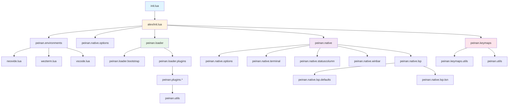
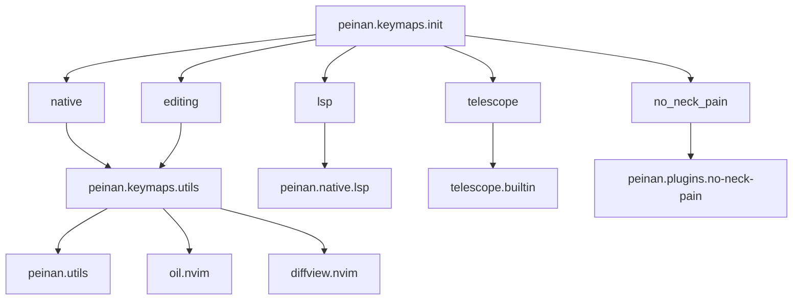

# Dependencies

This page explains the dependencies between modules in the Neovim configuration.

## Module Dependency Diagram

## Initialization Flow

## Plugin Dependencies

## Keymap Dependencies

## Configuration File Load Order

1. **`init.lua`** - Entry point
2. **`alex/init.lua`** - Main initialization
3. **`alex/environments/init.lua`** - Environment detection
4. **`alex/native/options.lua`** - Basic option settings
5. **`alex/loader/init.lua`** - Plugin loader initialization
6. **`alex/native/init.lua`** - Native features initialization
7. **`alex/native/lsp/init.lua`** - LSP setup
8. **`alex/keymaps/init.lua`** - Keymap settings
9. **Plugin settings** - Individual plugin configuration files (lazy loaded)

## Important Dependency Explanations

### Environment Module

The environment module (`peinan.environments`) runs before all other modules. This allows environment-specific initialization control.

### Option Settings

`peinan.native.options` must run before plugins are loaded. This ensures plugins can reference the correct option settings.

### Plugin Loader

`peinan.loader` initializes Lazy.nvim and loads all plugin definitions. Plugins are lazy-loaded, so only configurations are loaded at startup.

### Keymaps

Keymaps may be set after plugins are loaded (e.g., Telescope, no-neck-pain). This allows access to plugin-specific features.

