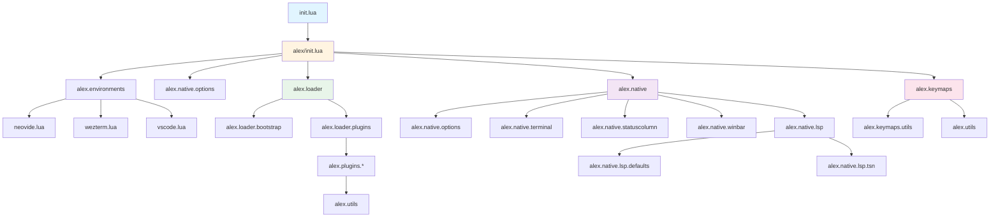
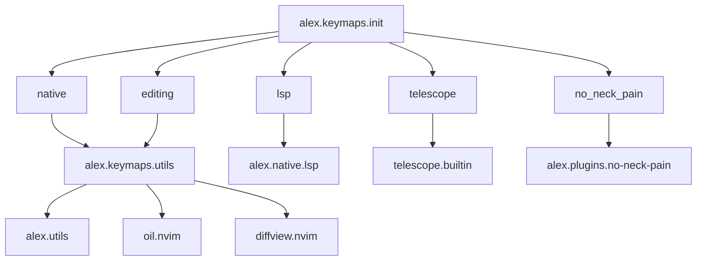

# 依存関係

このページでは、Neovim設定内のモジュール間の依存関係を説明します。

## モジュール依存関係図

## 初期化フロー

## プラグイン依存関係

## キーマップ依存関係

## 設定ファイルの読み込み順序

1. **`init.lua`** - エントリーポイント
2. **`alex/init.lua`** - メイン初期化
3. **`alex/environments/init.lua`** - 環境検出
4. **`alex/native/options.lua`** - 基本オプション設定
5. **`alex/loader/init.lua`** - プラグインローダー初期化
6. **`alex/native/init.lua`** - ネイティブ機能初期化
7. **`alex/native/lsp/init.lua`** - LSP設定
8. **`alex/keymaps/init.lua`** - キーマップ設定
9. **プラグイン設定** - 各プラグインの設定ファイル（遅延読み込み）

## 重要な依存関係の説明

### 環境モジュール

環境モジュール（`alex.environments`）は、他のすべてのモジュールの前に実行されます。これにより、環境に応じた初期化の制御が可能になります。

### オプション設定

`alex.native.options`は、プラグインが読み込まれる前に実行される必要があります。これにより、プラグインが正しいオプション設定を参照できます。

### プラグインローダー

`alex.loader`は、Lazy.nvimを初期化し、すべてのプラグイン定義を読み込みます。プラグインは遅延読み込みされるため、起動時には設定のみが読み込まれます。

### キーマップ

キーマップは、プラグインが読み込まれた後に設定される場合があります（例：Telescope、no-neck-pain）。これにより、プラグイン固有の機能にアクセスできます。

